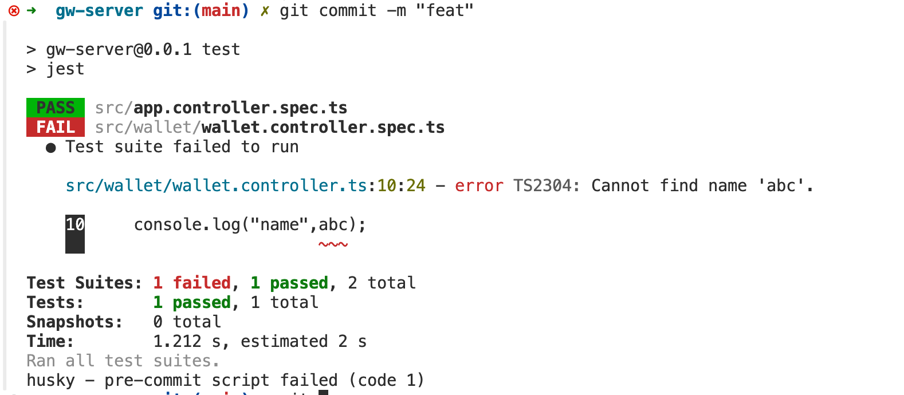
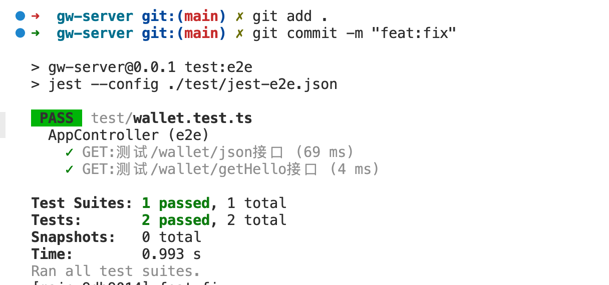

## 版本和框架
#### nodejs > 18.3.0
#### [NestJs 开发者文档](https://github.com/nestjs/nest)

## git 分支
```shell
  main 
  prod  // 生产分支
  dev // 测试分支
  dev-[your-feature]  // 单独功能分支
```
### git 提交代码规范
  当git commit时 会自动触发eslint 脚本和jest单元测试（端到端测试需要手动 ``` yarn test:e2e ``` )


<!-- git commit hooks  -->
### 测试未通过

### 测试通过

## 开发脚本

```bash
$ yarn install
```

## Running the app

```bash
# development
$ yarn run start

# 热更新开放
$ yarn run start:dev

# 部署
$ yarn run start:prod
```

## 测试脚本

```bash
#  单元测试
$ yarn run test

# 端到端测试
$ yarn run test:e2e

# test coverage
$ yarn run test:cov
```


